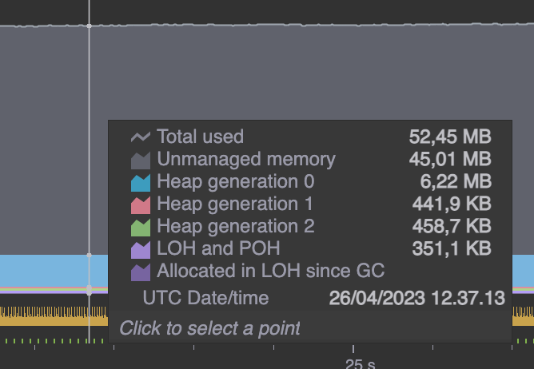

# Concurrent word counter

The counter takes two arguments, one for the input directory. All txt files will be examined and counted.
Filtered words can be passed as another text file, as the second argument.

Use it:
`WordCounter {inputDirectory} {exclusionFile?}`

The `Wordcounter/input/` directory may be used to try the implementation.

## Speed vs memory footprint @ 1000 samples

| Method                          | Time | Memory Footprint |
|---------------------------------|------|------------------|
| No-concurrency & Smaller chunks | 35ms | 49mb             |
| Concurrency & Smaller chunks    | 14ms | 64mb             |
| No-concurrency & Larger chunks  | 34ms | 60mb             |
| Concurrency & Larger chunks     | 14ms | 75mb             |

### Bigger chunks

### Smaller chunks
